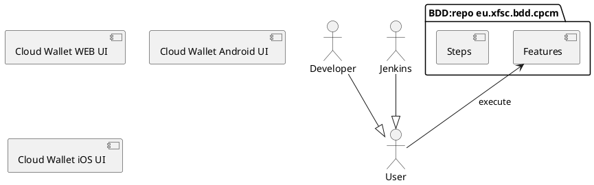

# CPCM (Cloud Personal Credential Manager) Behaviour-driven development (BDD) framework

Based on XFSC Python based BDD lib [eu.xfsc.bdd.core].

# Description

The components' relationship is drawn in Plant UML syntax below.



# Getting started

## Requirements

* Clone

  ```bash
  git clone git@gitlab.eclipse.org:eclipse/xfsc/organisational-credential-manager-w-stack/bdd.git \
    -b optional-branch-name-if-not-main
  
  git clone git@gitlab.eclipse.org:eclipse/xfsc/dev-ops/testing/bdd-executor.git \
    -b optional-branch-name-if-not-main
  ```

* Docker Engine (Docker Desktop, Podman machine, Rancher ...)
* For macOS or Linux, we provide below instructions on how to set up.
* For Windows, we recommend a dockerized setup or a remote (ssh) Linux dev server.

## Setup

For setup, look into [eu.xfsc.bdd.core/README.md].

## Run

### 1. Start all required services.

TBA

```bash
$ make TBA
```

TBA: Start Component as Docker container

> **_HINT:_** Ensure on macOS to start Docker Engine (Desktop Docker, Podman machine or Rancher)
before running the below command.

```bash
# Start component and leave it running as a process
$ make TBA
```

### 2. Execute BDD features [features](features)

```bash   
make run_bdd_dev
```

## License

Apache License Version 2.0 see [LICENSE](LICENSE).

----------------------------------------------------------------------------------

[eu.xfsc.bdd.core]: https://gitlab.eclipse.org/eclipse/xfsc/dev-ops/testing/bdd-executor
[eu.xfsc.bdd.core/README.md]: https://gitlab.eclipse.org/eclipse/xfsc/dev-ops/testing/bdd-executor/-/blob/main/README.md?ref_type=heads#setup 