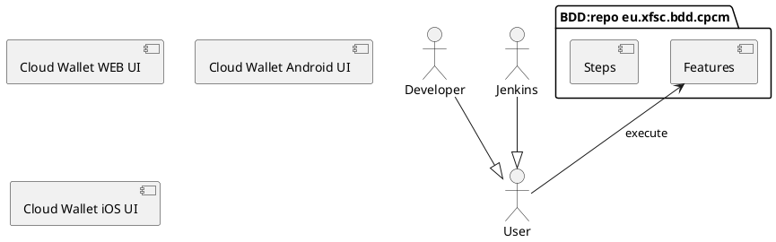

# CPCM (Cloud Personal Credential Manager) Behaviour-driven development (BDD) framework

Based on XFSC Python based BDD lib [eu.xfsc.bdd.core].

# Description

The components' relationship is drawn in Plant UML syntax below.



# Getting started

## Pre-requisites
 - Python 3.12 or later

## Requirements

* In the desired folder perform the following bash commands (create folder structure and clone CORE w/submodules, update to latest, checkout main) 
  ```Bash
      mkdir -p bdd_testbed/xfsc/dev-ops/testing
      cd bdd_testbed/xfsc/dev-ops/testing
      git clone --recurse-submodules git@gitlab.eclipse.org:eclipse/xfsc/dev-ops/testing/bdd-executor.git
      cd bdd-executor
      git submodule update --remote --merge
      git submodule foreach --recursive git checkout main
      cd ..
      mv bdd-executor eu.xfsc.bdd.core
  ```

  * Setup virtual environment
    ```bash
    python -m venv coretest
    source coretest/bin/activate
    pip install -r ../../requirements-dev.txt
    ```
* Set the coretest's(venv name) python as an interpreter in the IDE
* Docker Engine (Docker Desktop, Podman machine, Rancher ...)
* For macOS or Linux, we provide below instructions on how to set up.
* For Windows, we recommend a dockerized setup or a remote (ssh) Linux dev server.

If playwright hasn't been previously used, run `playwright install`

## Run tests locally

Go to src inside implementations' respective project (e.g. 'cpcm')
```bash
$ cd cpcm/src
```

Run behave (all feature files)
```bash
$ behave ../features
```

Run behave (specific feature)
```bash
$ behave ../features feature_file_name.feature
```

Run behave with HTML report
```bash
$ behave implementations/cpcm/features/feature_file_name.feature -f html-pretty -o reports/html_report.html
```
Explanation for modification:

**behave** - runner keyword

**implementations/cpcm/features/settings.feature** - route to file and file name

**-f html-pretty** - specify report formatter

**-o reports/html_report.html** - specify output location and report file name

## HTML report information

For further information see https://pypi.org/project/behave-html-pretty-formatter/

## Standalone functions

  * #### User registration
    *   **user_registration.py** can be run separately that will register as many users as you wish based on the **users.csv** - currently only invalid emails are used with gmaill.com (note the double L!)
  * #### Parallel user testing
    *   **selenium_login.py** used for parallel user testing - number of workers can be modified in the code at the commented place 


## Vulnerability scan

  * #### Prerequisites
    
    * Install Grype and Syft
      ```bash
      brew install grype syft
      ```
      
  * #### Scan and report generation

    * Create an SBOM on the directory
      ```bash
      syft dir:PATH_TO_REPO -o syft-json=sbom.syft.json
      ```
    
    * Convert between SBOM formats, such as CycloneDX, SPDX
      ```bash
      syft convert sbom.syft.json -o cyclonedx-json=sbom.cdx.json
      ```

    * Generate the report in JSON or table format
      ```bash
      grype sbom:sbom.cdx.json -o json > vulnerability-report.json
      grype sbom:sbom.cdx.json -o table > vulnerability-report
      ```
      

## Setup

For setup, look into [eu.xfsc.bdd.core/README.md].


## License

Apache License Version 2.0 see [LICENSE](LICENSE).

----------------------------------------------------------------------------------

[eu.xfsc.bdd.core]: https://gitlab.eclipse.org/eclipse/xfsc/dev-ops/testing/bdd-executor
[eu.xfsc.bdd.core/README.md]: https://gitlab.eclipse.org/eclipse/xfsc/dev-ops/testing/bdd-executor/-/blob/main/README.md?ref_type=heads#setup 